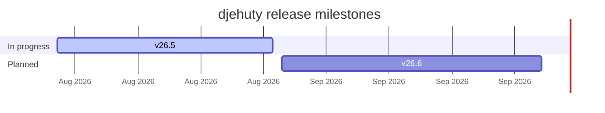

### 4TU.ResearchData

**Open research data infrastructure for science, engineering and design.**

[Website](https://data.4tu.nl) · [djehuty docs](https://djehuty.4tu.nl) · [Contributing](https://github.com/4TUResearchData/.github/blob/main/CONTRIBUTING.md) · [Code of conduct](https://github.com/4TUResearchData/.github/blob/main/CODE_OF_CONDUCT.md)

---

## What we build

| Project | What it is | |
|---|---|---|
| **[djehuty](https://github.com/4TUResearchData/djehuty)** | The repository system powering 4TU.ResearchData and Nikhef |  |
---

## Roadmap

Live progress on the next djehuty releases — full detail on the
**[milestones board →](https://github.com/4TUResearchData/djehuty/milestones)**

<!-- MILESTONES:START -->

<b>v24.4.1</b> &nbsp;·&nbsp; due 2026-08-07 &nbsp;·&nbsp; <code>██████████</code> 100% &nbsp;·&nbsp; 3 of 3 done

- [x] [#231](https://github.com/4TUResearchData/djehuty/issues/231) \[BUG\]: Remove ROR link from institution name
- [x] [#229](https://github.com/4TUResearchData/djehuty/issues/229) \[BUG\]: Author names created from SAML login include the login name in brackets
- [x] [#218](https://github.com/4TUResearchData/djehuty/issues/218) \[BUG\]: COLLECT button adds the dataset to the wrong collection (always the last one in the list)

<b>v26.5</b> &nbsp;·&nbsp; due 2026-08-31 &nbsp;·&nbsp; <code>░░░░░░░░░░</code> 0% &nbsp;·&nbsp; 0 of 1 done

- [ ] [#237](https://github.com/4TUResearchData/djehuty/issues/237) \[NEW FEATURE\]: Support custom-style in Djehuty

<b>v26.6</b> &nbsp;·&nbsp; due 2026-09-30 &nbsp;·&nbsp; <code>░░░░░░░░░░</code> 0% &nbsp;·&nbsp; 0 of 1 done

- [ ] [#41](https://github.com/4TUResearchData/djehuty/issues/41) \[NEW FEATURE\] Enable registration of physical samples (IGSNs)

<!-- MILESTONES:END -->
<!--
  The table above is regenerated daily by .github/workflows/update-milestones.yml.
  Anything you type between the MILESTONES markers will be overwritten.
-->

---

## Getting involved

- **Report a bug or request a feature** — open an issue on the relevant repository.
- **Good first issues** — [browse them here](https://github.com/4TUResearchData/djehuty/issues?q=is%3Aopen+label%3A%22🌱+good+first+issue%22).
- **Security** — report vulnerabilities privately to <security@djehuty.4tu.nl>, not via a public issue. See our [security policy](https://github.com/4TUResearchData/djehuty/blob/main/SECURITY.md).
- **Governance** — how decisions get made is documented in [GOVERNANCE.md](https://github.com/4TUResearchData/djehuty/blob/main/GOVERNANCE.md).

4TU.ResearchData is a research infrastructure, community and training provider, led and governed by the four technical universities in the Netherlands.

