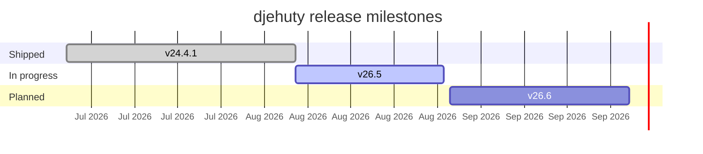

### 4TU.ResearchData

**Open research data infrastructure for science, engineering and design.**

[Website](https://data.4tu.nl) · [Documentation](https://djehuty.4tu.nl) · [Contributing](https://github.com/4TUResearchData/.github/blob/main/CONTRIBUTING.md)

---

## What we build

| Project | What it is | Status |
|---|---|---|
| **[djehuty](https://github.com/4TUResearchData/djehuty)** | The repository system powering 4TU.ResearchData and Nikhef |   |

<!-- Add further repositories as rows here. -->

---

## Roadmap

Live progress on the next djehuty releases. Full detail on the
**[milestones board →](https://github.com/4TUResearchData/djehuty/milestones)**

<!-- MILESTONES:START -->
| Milestone | Due | Progress | Issues |
|---|---|---|---|
| [`v26.5`](https://github.com/4TUResearchData/djehuty/milestone/2) | 2026-08-31 | `░░░░░░░░░░` 0% | 0 / 2 |
| [`v26.6`](https://github.com/4TUResearchData/djehuty/milestone/3) | 2026-09-30 | `░░░░░░░░░░` 0% | 0 / 1 |
<!-- MILESTONES:END -->

Table refreshed daily by [`update-milestones.yml`](https://github.com/4TUResearchData/.github/blob/main/.github/workflows/update-milestones.yml). Do not edit between the markers by hand.

### Timeline

### Live badges (alternative to the table)

Badges update themselves with no workflow at all — the number at the end is the
milestone number from its URL.

---

## Getting involved

- **Report a bug or request a feature** — open an issue on the relevant repository.
- **Good first issues** — [browse them here](https://github.com/4TUResearchData/djehuty/issues?q=is%3Aopen+label%3A%22good+first+issue%22).
- **Security** — please report vulnerabilities privately via our [security policy](https://github.com/4TUResearchData/.github/security/policy).

4TU.ResearchData is the data repository of the four Dutch universities of technology.

