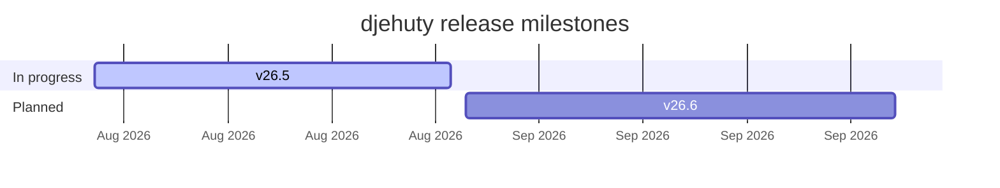

### 4TU.ResearchData

**Open research data infrastructure for science, engineering and design.**

[Website](https://data.4tu.nl) · [djehuty docs](https://djehuty.4tu.nl) · [Contributing](https://github.com/4TUResearchData/djehuty/blob/main/CONTRIBUTING.md) · [Code of conduct](https://github.com/4TUResearchData/djehuty/blob/main/CODE_OF_CONDUCT.md) · [djehuty Community](https://djehuty.4tu.nl/community/)

---

## What we build

| Project | What it is | |
|---|---|---|
| **[djehuty](https://github.com/4TUResearchData/djehuty)** | The repository system powering 4TU.ResearchData and Nikhef |  |
---

## Roadmap

Live progress on the next djehuty releases — full detail on the
**[milestones board →](https://github.com/4TUResearchData/djehuty/milestones)**

<!-- MILESTONES:START -->

<b>v26.7.1</b> &nbsp;·&nbsp; due 2026-10-02 &nbsp;·&nbsp; <code>██████████</code> 100% &nbsp;·&nbsp; 3 of 3 done

- [x] [#351](https://github.com/4TUResearchData/djehuty/issues/351) \[BUG\]: Collection editor author edit button calls a function that is not defined
- [x] [#350](https://github.com/4TUResearchData/djehuty/issues/350) IGSN: improve API doc request/response body for IGSN (/v3/pythical_sample) endpoints 
- [x] [#321](https://github.com/4TUResearchData/djehuty/issues/321) \[NEW FEATURE\]: Remove files from a specific published version (admin)

<b>v26.8</b> &nbsp;·&nbsp; due 2026-10-09 &nbsp;·&nbsp; <code>░░░░░░░░░░</code> 0% &nbsp;·&nbsp; 0 of 7 done

- [ ] [#349](https://github.com/4TUResearchData/djehuty/issues/349) \[BUG\]: Collection editor drops the ORCID of a manually added author
- [ ] [#299](https://github.com/4TUResearchData/djehuty/issues/299) \[NEW FEATURE\]: admin > published datasets > retract | Enable retract all or multiple versions
- [ ] [#278](https://github.com/4TUResearchData/djehuty/issues/278) \[IMPROVEMENT\]: add COLLECT button to the physical sample landing page
- [ ] [#262](https://github.com/4TUResearchData/djehuty/issues/262) \[IMPROVEMENT\]: Rework usage statistics to avoid overloading Virtuoso
- [ ] [#258](https://github.com/4TUResearchData/djehuty/issues/258) \[IMPROVEMENT\]: Make draft dataset deletion recoverable (soft delete)
- [ ] [#153](https://github.com/4TUResearchData/djehuty/issues/153) \[BUG\]: search bar giving a GATEWAY TIMEOUT error on the first run
- [ ] [#77](https://github.com/4TUResearchData/djehuty/issues/77) \[BUG\]: Unable to clear 'Derived From' metadata field

<b>v26.8.1</b> &nbsp;·&nbsp; due 2026-10-16 &nbsp;·&nbsp; <code>░░░░░░░░░░</code> 0% &nbsp;·&nbsp; 0 of 1 done

- [ ] [#285](https://github.com/4TUResearchData/djehuty/issues/285) \[BUG\]: the 'dataset search' option on the EDIT COLLECTION page doesn't work

<b>v26.9</b> &nbsp;·&nbsp; due 2026-10-23 &nbsp;·&nbsp; <code>░░░░░░░░░░</code> 0% &nbsp;·&nbsp; 0 of 0 done

<b>v26.9.1</b> &nbsp;·&nbsp; due 2026-10-30 &nbsp;·&nbsp; <code>░░░░░░░░░░</code> 0% &nbsp;·&nbsp; 0 of 0 done

<!-- MILESTONES:END -->
<!--
  The table above is regenerated daily by .github/workflows/update-milestones.yml.
  Anything you type between the MILESTONES markers will be overwritten.
-->

```mermaid
gantt
    title djehuty release milestones
    dateFormat  YYYY-MM-DD
    axisFormat  %b %Y
    section In progress
    v26.5          :active, m2, 2026-08-07, 2026-08-31
    section Planned
    v26.6          :        m3, 2026-09-01, 2026-09-30
```

---

## Getting involved

- **Report a bug or request a feature** — open an issue on the relevant repository.
- **Good first issues** — [browse them here](https://github.com/4TUResearchData/djehuty/issues?q=is%3Aopen+label%3A%22🌱+good+first+issue%22).
- **Security** — report vulnerabilities privately to <security@djehuty.4tu.nl>, not via a public issue. See our [security policy](https://github.com/4TUResearchData/djehuty/blob/main/SECURITY.md).
- **Governance** — how decisions get made is documented in [GOVERNANCE.md](https://github.com/4TUResearchData/djehuty/blob/main/GOVERNANCE.md).
- **Community hour** - Join our monthly community call. Find out more on the [djehuty Community](https://djehuty.4tu.nl/community/) webpage. 

4TU.ResearchData is a research infrastructure, community and training provider, led and governed by the four technical universities in the Netherlands.

